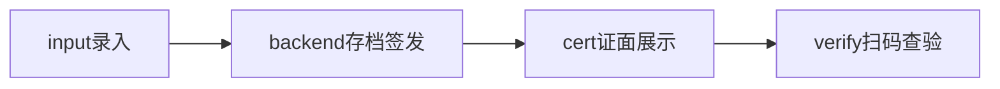
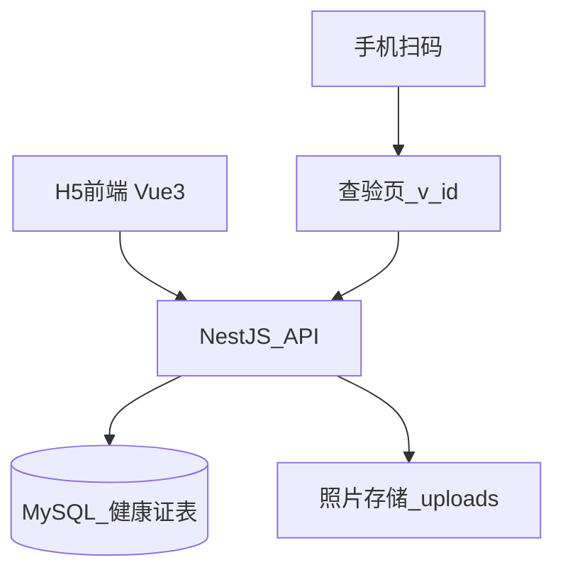

# 医院健康证 H5 生成系统技术方案

## 1. 项目概述

为医院打造一套运行在公网的 H5 健康证生成与查验系统。

**核心流程：**



**用户角色：** 医院办证窗口工作人员（录入）、办证群众（领证）、社会公众/监管方（扫码查验）。

## 2. 功能需求清单

### 2.1 录入页 `/`

- 输入项：姓名、身份证号（18 位校验）、证件照片（拍照/上传）、地区（下拉）、体检机构（按地区联动的医院下拉，多地区多医院）
- 交互：身份证输入后实时解析年龄性别、照片前端压缩裁剪、证面实时预览、提交前二次确认

### 2.2 证面展示页 `/cert/:id`

健康证卡片内容：

- 编号、姓名、年龄、类别（固定：食品生产经营）
- 人物图片、体检机构（某某地区第一人民医院）、有效期
- 专属二维码

支持长按保存图片、一键打印。

### 2.3 扫码查验页 `/v/:id`

- 公开免登录，浏览器扫码即开
- 显示：照片、姓名（脱敏如张*明）、编号、类别、体检机构、有效期、状态（有效/过期/作废）
- 显示查验时间，防止截屏冒用建议加水印

> 本期范围：只需生成+扫码查验，不做登录、历史列表、导出、作废管理，二期再加。

## 3. 核心业务规则（自动生成）

| 字段 | 规则 |
|---|---|
| 年龄 | 从身份证第 7-14 位出生日期算周岁 |
| 编号 | `JK + 年份 + 地区码 + 6位流水`，如 `JK2026HB000123`，数据库唯一索引保证不重复 |
| 类别 | 固定 `食品生产经营` |
| 体检机构 | `地区 + 医院` 联动选择 |
| 有效期 | 开始=签发前一天，结束=开始+1年-1天，展示 `2025.09.24 - 2026.09.23` |
| 二维码 | 内容为查验短链 `https://你的域名/v/{verifyId}`，不直接裸露身份证号 |

## 4. 技术栈

- **前端 H5：** Vue3 + Vite + TypeScript + Vant 4 + `qrcode` + `html2canvas`
- **后端：** Node.js + NestJS + Prisma ORM
- **数据库：** 初期 SQLite，上线切 MySQL 8
- **文件存储：** 本地 `uploads/` 存照片（按月分目录），后期平滑迁到 OSS
- **部署：** Nginx 反代 + HTTPS，前后端同域，公网云服务器+已备案域名

**选型理由：**

- H5 用 Vue+Vant 对手机拍照、表单校验、证面还原度最好
- NestJS 接口规范，方便以后加登录、审核、批量导出
- 二维码必须指向后端查验接口，纯前端无法实现联网可查

## 5. 系统架构



## 6. 数据模型（最小）

```python
HealthCert {
  id: 自增主键
  verifyId: 查验码唯一
  certNo: 编号唯一，如 JK2026HB000123
  name: 姓名
  idCardHash: 身份证号加密存
  birthDate / age / gender: 解析得出
  photoUrl: 照片地址
  regionCode / regionName / hospitalName: 地区医院
  category: 固定食品生产经营
  validFrom / validTo: 有效期
  status: 有效/过期/作废
}
```

## 7. 接口设计

- `POST /api/certs`：提交姓名、身份证、照片、地区医院，后端校验→算年龄→生成编号有效期→存库→返回证面数据
- `GET /api/certs/:id`：领证页取证面详情
- `GET /api/verify/:verifyId`：扫码查验，返回脱敏信息+状态

## 8. 证面实现

- 用 HTML+CSS 高度还原实物证（红头、表格线、防伪底纹）
- 二维码用前端 `qrcode` 按查验链接绘制
- 保存图片用 `html2canvas` 将 DOM 转 PNG

## 9. 安全与合规提醒

- 全站 HTTPS，查验页信息脱敏
- 照片大小限制 5MB，前端压缩到 800px 再上传
- 身份证做正则+校验位双重校验
- 需要提供：地区医院清单+地区码、证面样证照片、域名和服务器备案情况

## 10. 里程碑

- 第一步：确认地区医院表和样证样式
- 第二步：前后端脚手架+数据库跑通
- 第三步：录入+证面生成联调
- 第四步：扫码查验+公网部署
